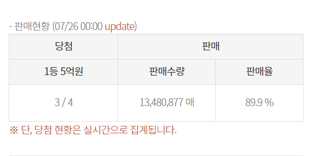
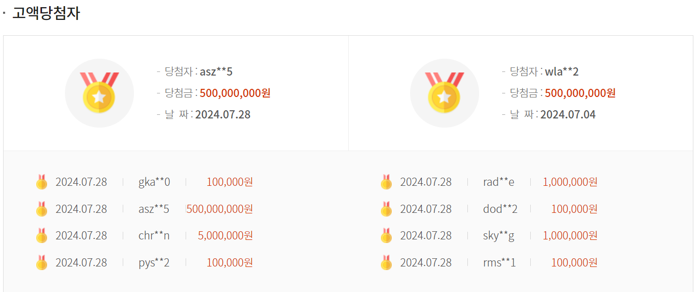
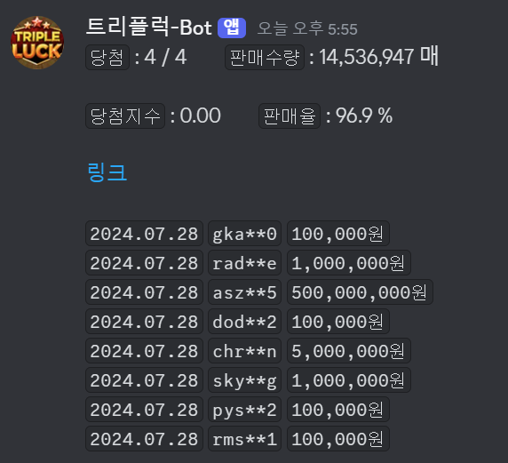

# 로또 사이트 정보 가져와서, 디스코드 웹훅으로 채널로 보내기  
[로또사이트](https://dhlottery.co.kr/gameInfo.do?method=lottoMainView&lottoId=LI21)  

  
  

  

/
├── appsscript.json                 // Apps Script 프로젝트 설정
├── Config.js                       // 설정 값들 (URL, ID 등)
├── main.js                         // 메인 진입점 (트리거 설정)
├── services-DataService.js         // 데이터 처리 로직
├── services-ApiService.js          // 외부 API 호출 (롯토 데이터 크롤링)
├── services-StorageService.js      // 구글 스프레드시트 및 문서 저장 로직
├── utils-Parser.js                 // 데이터 파싱 유틸리티
├── utils-Formatter.js              // 데이터 포맷팅 유틸리티
└── integrations-DiscordService.js  // 디스코드 웹훅 통합